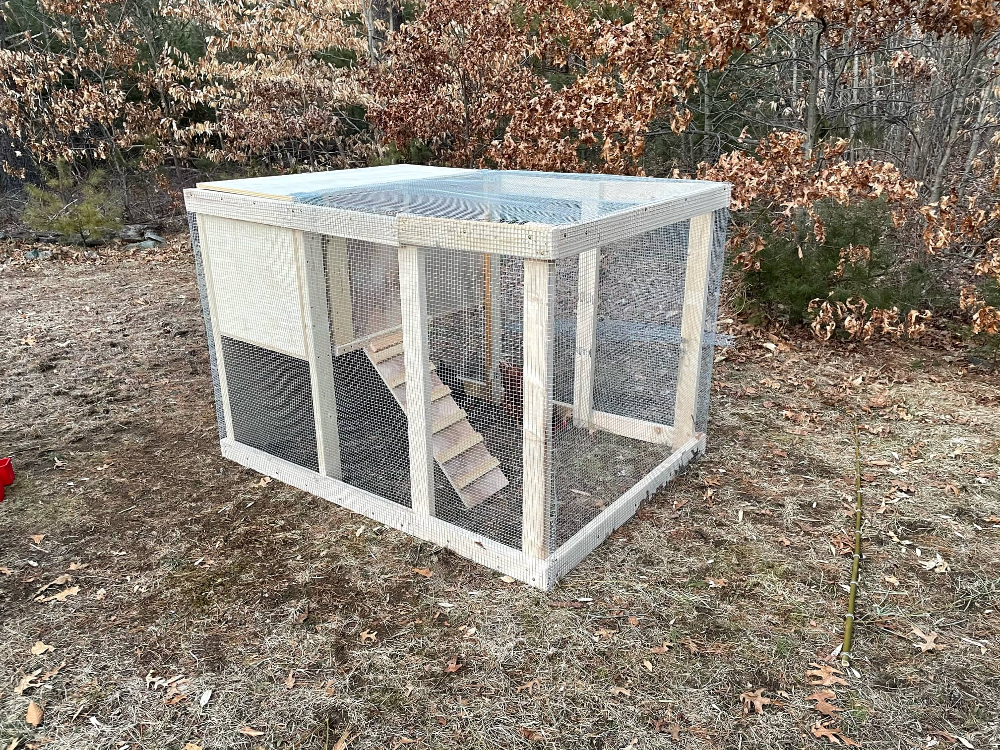
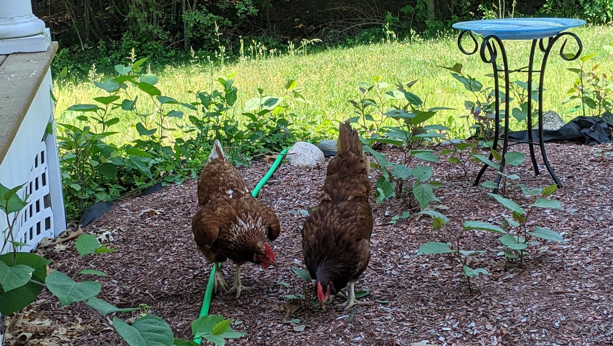

Title: I'm not a carpenter
Date: 2023-06-28 10:45
Category: General
Cover: images/coop-design.jpg
Summary: I enjoy woodworking, but I'm not very good at it. On and off over the last two months, I've been working on building a new chicken coop to house our new chicks.

I enjoy woodworking, but I'm not very good at it. On and off over the last two months, I've been working on building a new chicken coop to house our new chicks.

We've had chickens for a couple of years (and my spouse and I both had chickens growing up) and housing the chickens has been an ongoing challenge. Coops from kits are expensive and don't meet all of our needs, so I've been thinking about chicken coop construction and design for a long time. My first makeshift coop was constructed in two days to house our two bully chickens (who both passed away from unrelated medical conditions this week, RIP Regina and Jennifer), and it was an incredibly poorly designed, but functional coop.

Not bad for two days, but pretty janky

This year we are adding nine new chicks to our flock: three (more) ameraucanas, three copper blue marans, two salmon faverolles, and a single light brahma (who was supposed to be a third faverolles - whoops). Naturally, we wanted to have a good solution to house them, and to ideally house our entire flock in a single coop. Rather than buying a professionally designed coop, we decided to DIY a larger coop so we could get the benefits of a custom-designed coop (high ceilings in the run, for instance), but also so we could repair and modify the coop easily using off-the-shelf materials.

This all sounds totally reasonable, right? I'm pretty handy, so this shouldn't be a big deal! I whipped up a design in SketchUp and started ordering materials.

Unfortunately, this is the largest structure I've ever built alone, and I've had to learn some hard lessons along the way.

The biggest thing that I learned is that as the scale increases, the errors and flaws compound. The mark of a good carpenter is not simply to build something perfectly to spec. That's the ideal, obviously, but especially when dealing with imperfect materials (and this wood was certainly imperfect), errors will occur. The challenge is in knowing which errors and imperfections must be corrected through rework, versus the errors that can be worked around and corrected in aggregate.

For example, if you are spacing your chicken run supports at regular intervals, you'll probably need pieces of wood cut to size to go between them. If you go ahead and cut all of them at the same time, it means that you're likely to be able to compare them and have extremely regular lengths. However, if you discover that your cut was off by an eighth of an inch for EACH of those cuts, suddenly your last support is dangling an inch over the end of the base of the coop. If, instead, you marked the positions of each support on the base, placed the supports, and then measured your pieces of wood and installed them as you went, it shouldn't be possible to overshoot the end of your base. You might have increased variance in actual lengths of those pieces of wood (as a result of warping or other irregularities in the supports, or simple human error), but your result would still fit the most critical constraints of your build.

But let's add another real-world complication to the mix: the distance between the supports can't be too terribly irregular, or the standard sizes of hardware cloth going between them might not reach. So now we have the hard constraint of ensuring that the supports are all placed on top of the base as before, but we have added the constraint of needing the span to match the width of the (unfortunately, also slightly irregular) hardware cloth. In hindsight, I probably should have placed each set of supports, comparing against the width of the hardware cloth, and only measuring and cutting the next span once the previous span was screened in.

But, of course, I was naive going into this. I assumed "measure twice, cut once" would be enough to keep me out of trouble. I was wrong, and I've learned a lot about how to be strategic in my lack of perfection in order to build things only as well as they need to be, and not to strive for an ideal that only comes with a great deal more practice than I will ever get at this scale of construction.

Rough time-lapse of construction

Now, because I'm a software guy and a dork, as I was thinking through all of this, I started to consider how these lessons relate to building software. I quickly realized that I already account for problems and imperfections like this when I'm coding, and while the specifics of the problems are very different from those found in chicken coop construction, the same lessons apply. I may not be a professional carpenter, but I do have a lot of professional experience coding.

Responsible error handling, modularity and extensibility, function sizing, self-commenting naming, logging and observability, and scalability planning all factor into my initial design these days without me even thinking to include them. That's just the "shape" of my v1, and the process by which I construct and new software includes micro-refactors (while it's still easy) to set myself up for success. Now, mind you, [YAGNI](https://en.wikipedia.org/wiki/You_aren%27t_gonna_need_it) still applies; there's no reason to try to build a perfect temple of code with every new project. Finding the sweet spot of future-proofing your software is a lot like finding the sweet spot of precision required for building a chicken coop. If it's never going to be a 10-story chicken coop, you can get away with a lot.

Maybe it's a bit of a feeble analogy, but it made me feel better about not being a terribly good carpenter.

Anyway, the coop is not done (and it'll never truly be done), but it'll be move-in ready as of today. The chicks are getting too large for the stock tank they were raised in, so the timing here is good. By the end of the summer, we'll have all of our remaining members of the old flock moved in with them, significantly simplifying our chicken-keeping operation. This has been a challenging and exhausting project, but worth every curse, scrape, and penny to give our chickens a good home.

RIP Regina and Jennifer

