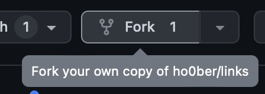
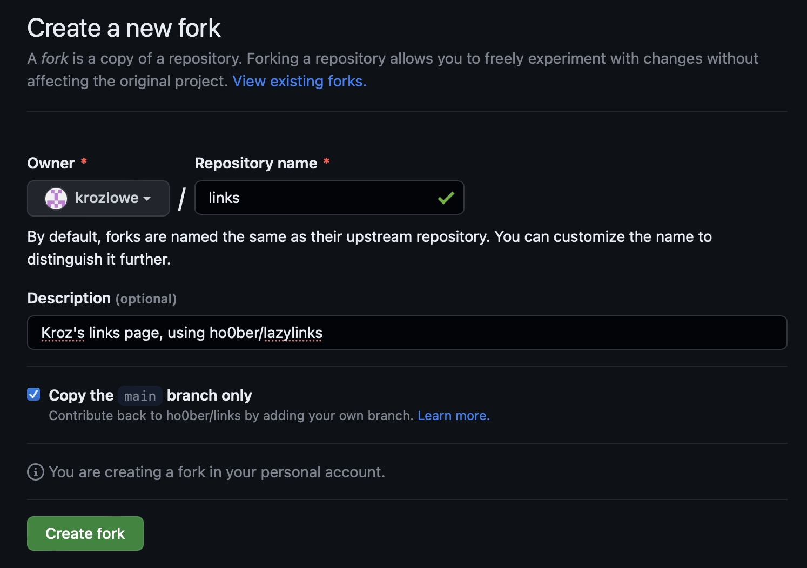
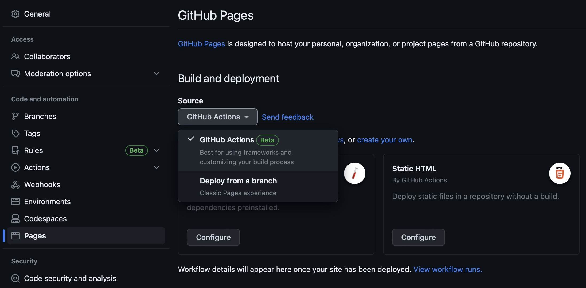
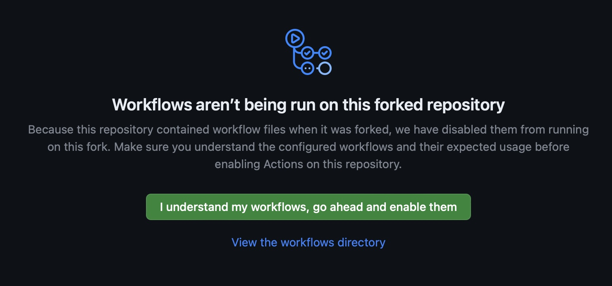
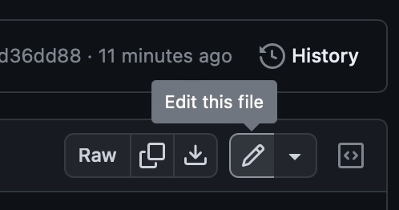
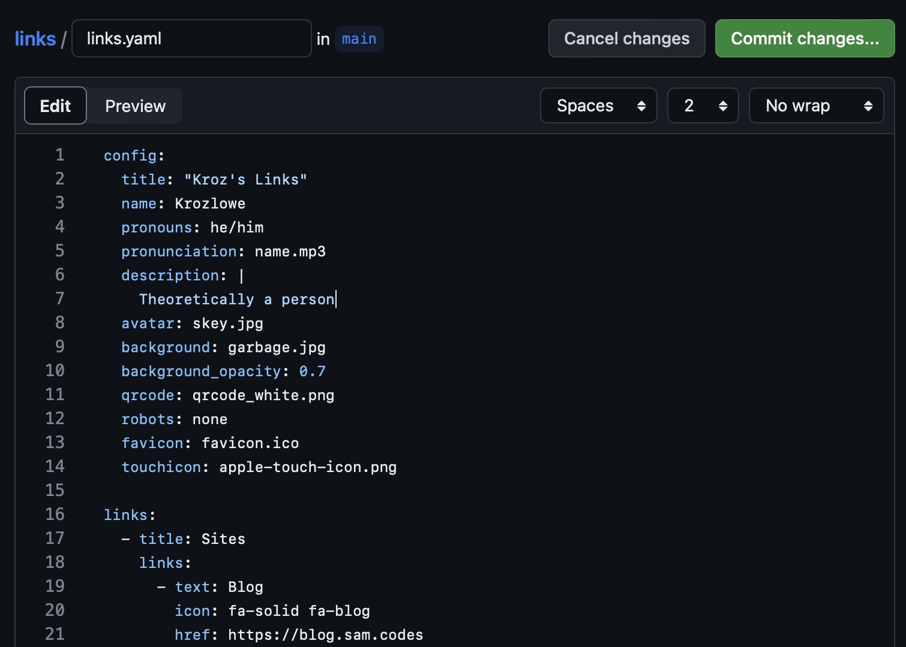
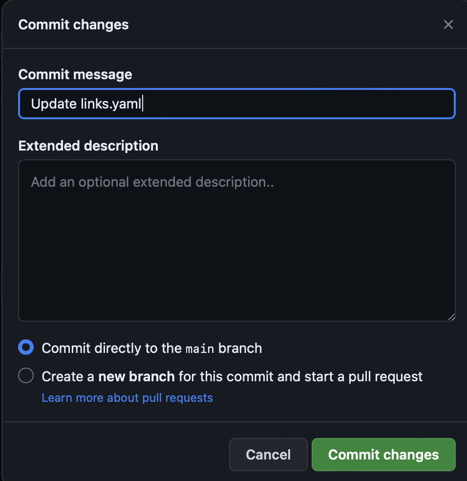
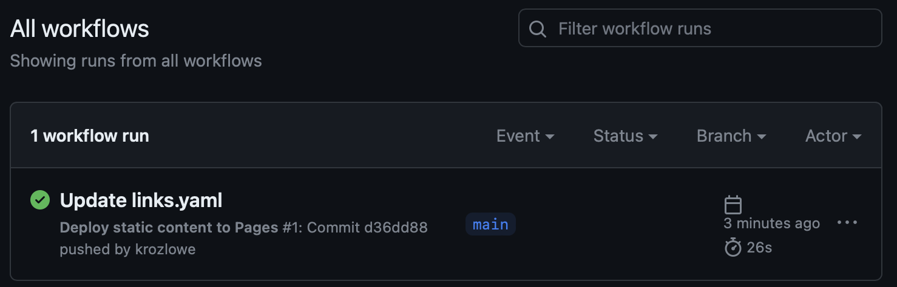
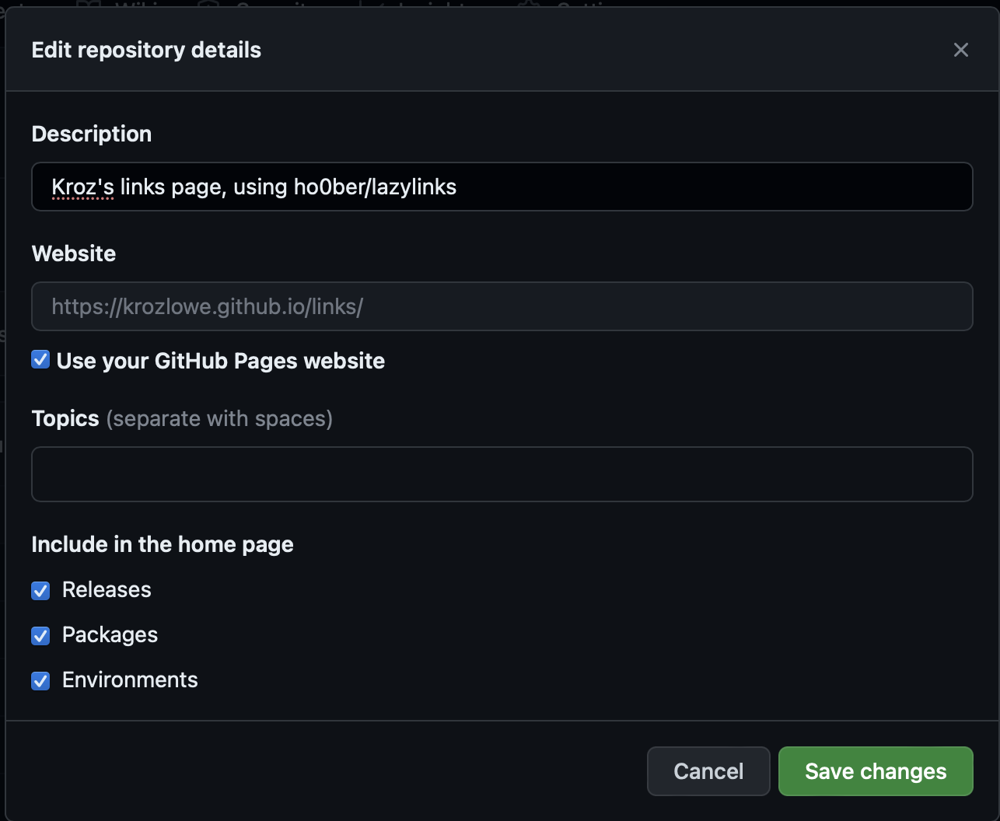

Title: Lazylinks: Link pages for lazy people
Date: 2023-07-02 19:30
Category: Code
Cover: images/links-page.jpg
Summary: Over the last few months I've found myself wishing I had a simple website I could send someone to help them find my various accounts. Between layoffs and social media network meltdowns, I know a lot of people who are setting up similar sites.

## What is lazylinks?
Over the last few months I've found myself wishing I had a simple website I could send someone to help them find my various accounts. Between layoffs and social media network meltdowns, I know a lot of people who are setting up similar sites.

The usual approaches to making links pages fall into a few rough categtories:

* Adding a new page to an existing website or blog with all of your links
* Using a tool like Linktree, Carrd, or countless other similar options
* Building a standalone links page from scratch
  
Adding a new page to an existing website was something I seriously considered, but ultimately decided against. My personal website isn't really set up to have clean, linkable pages (it's gimmicky) and I didn't really feel like fighting with HTML (or javascript) every time I wanted to update my links.

Using a tool like Linktree can be a quick way to get a links page up and running, but they usually lock features behind paid plans. They limit your customization options by their nature. It's a good tradeoff for simplicity vs flexibility, but there were just a few too many negatives for me. Linktree, for instance, can't use custom domains, and it's yet another login to make sure is secure. Such sites are a potential target for bad actors, especially if they put their on donation link into someone else's profile.

Building a standalone links page from scratch has a lot of appeal. The site is as secure as your version control, CI/CD, and hosting are (in my case, all three are GitHub). You have a ton of flexibility, limited only to what you feel like building in HTML/CSS/JS. But that flexibility is also the greatest drawback: starting from scratch is a pain. Additionally, I still don't really like having to update links in HTML; it's usually a lot of annoying boilerplate to make sure you copy correctly.

So this all leads to my solution: build a standalone links page *generator*. That's right, do _even more work_  than my third option! I'd been inspired by [Pelican](https://getpelican.com), the tool used to generate this blog, as an elegant approach to updating content for folks who are more comfortable in version control and markdown files than in a GUI backend for blogging. My solution uses the same approach: a simple python package that makes it easy to write content and generate static HTML to be deployed.

Naturally, instead of trying to reinvent the wheel, I searched for existing linktree-style static pages to use as a starting point. I stumbled across exactly what I was looking for, an extremely simple template on github: [alisa-yar/linktree-template](https://github.com/alisa-yar/linktree-template/). This saved me a ton of fiddly effort when getting my initial version up and running. Huge thanks to Alisa for open-sourcing a great little project. If you end up using my project, please consider [buying her a coffee](https://www.buymeacoffee.com/alisa.algo).

From there, I thought about how I would want to generate my links. I landed on a YAML file for defining global configuration options (backgrounds, page title) and the lists of links. Not everyone is a big fan of YAML, but I find it to be the most concise syntax for this type of configuration, and I'm very happy with how it turned out.

After that, it was a relatively short process of picking a templating package in python and whipping up a generator script. Thus, [Lazylinks](https://github.com/ho0ber/lazylinks) was born!

## How to set up your own lazylinks page

Shifting gears into tutorial mode, I'm going to walk you through how to get your own links page up and running using github pages. It's free, relatively easy (even for folks who are beginner programmers), and easy to modify. You don't even need a functioning python development environment to get started; you can do everything from within github!

We're going to start by forking _my_ links page repository. This will give you a working starting point:

* Go to [ho0ber/links](https://github.com/ho0ber/links)
* Click the "fork" button at the top right of the page
  

* pick a good name for your repository (or leave it as links) and click "create fork"

Next we'll configure the repository to use github pages and enable GitHub Actions workflows for the repository:

* In your new repository, click the settings button in the nav bar at the top
* Under "Code and automation" click "Pages"
* Select "GitHub Actions" in the source dropdown. This will make it so we can generate the static page in a GitHub Actions workflow, rather than needing to version control the generated HTML itself.

* Now click "Actions" in the nav bar at the top
* If prompted, click "I understand my workflows, go ahead and enable them"

Now you should be able to make changes to `links.yaml` and the worklow will run and deploy the site for you. Let's test that!

* Click on the "Code" button in the nav bar at the top
* Click on the `links.yaml` file to view it
* Click the edit button in the upper left of the file

* Make a simple change, like changing the name on the page

* Click "Commit changes" in the upper right and leave the default option of "commit directly to the `main` branch selected" and click "commit changes" again.

You just made your first changes to the links page! This should automatically trigger a workflow run to deploy those changes. Let's go check on them.

* Click "Actions" in the nav bar at the top again and look for the running workflow.

* Click on it and poke around if you like. It'll turn green when it completes (sometimes you might need to refresh the page)

Once the workflow completes, now you can go to your pages address to see the result. This should be `<your username>.github.io/<your repo name>/`, but here's an easy way to get your link:

* Click back on "Code" in the nav bar at the top
* Click on the gear next to the "About" section in the upper right corner of the page
* In the website section, check the "Use your GitHub Pages website" checkbox to replace my URL with your own

* Click save changes

Now the link to your links page is in the upper right of your repo's main page. Easy, right?

Hopefully, you get the idea from here, but you can go back into that `links.yaml` file and edit to your hearts content. You can add or remove links sections, change names and descriptions, and replace filenames for your avatar, background, and favicon. You'll also need to add/replace files in the "static" directory before they can be referenced in config, but you'll find that you can do that from GitHub's web interface too, if you like.

Lazylinks even allows you to define your own template (and replace the CSS in the static directory entirely), if you find that the layout isn't to your liking. Simply use the [lazylinks.mako](https://github.com/ho0ber/lazylinks/blob/main/lazylinks/lazylinks.mako) file in the lazylinks project repo as a starting point, and then update your workflow to add an additional commandline option to define the template to use, something like `lazylinks links.yaml --template mytemplate.mako`

Anyway, that's the extent of what I can cover this this tutorial. There's a lot more you can do, like setting up a custom domain for your links page, but it's pretty easy to find tutorials for that with a simple search.

Note that [lazylinks](https://github.com/ho0ber/lazylinks) itself is an open-source project, and if you find that you can't do something that you want to, you can fork it yourself and propose changes!

Good luck and enjoy!
