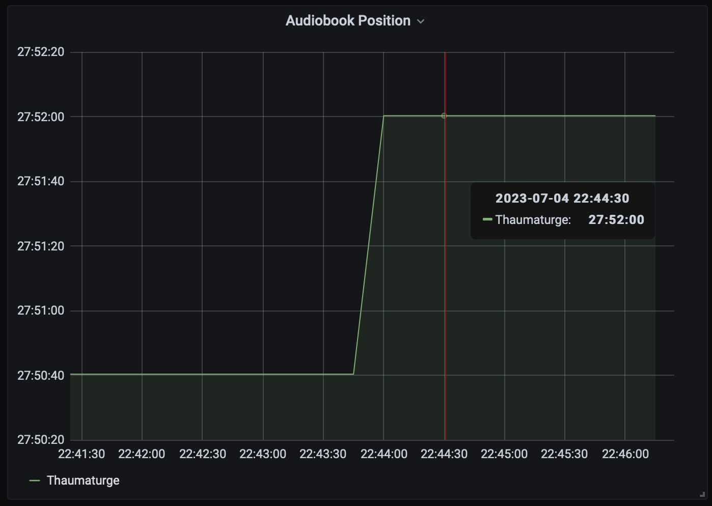

Title: Audible last-heard position plotting
Date: 2023-07-04 22:48:00
Category: Code
Cover: images/audiobook.jpg
Summary: I'm an avid audiobook listener, but I sometimes struggle with losing my place in my books if I fall asleep while listening or if my book autoplays on my (muted) car stereo for a long drive. This project is an attempt to help me find my lost place.

I'm an avid audiobook listener, but I sometimes struggle with losing my place in my books if I fall asleep while listening or if my book autoplays on my (muted) car stereo for a long drive. This project is an attempt to help me find my lost place.

I listen to books almost exclusively on Audible. I know, I know, I really shouldn't be feeding Amazon even more money, but I already have a large library there, and I have a very good setup for listening to my books while I fall asleep or drive (ideally not both at the same time).

One of the features of Audible that I use most frequently is the ability to pick up where I left off in my book on a different device. Unfortunately, this feature can be a bit buggy. Occasionally, I'll start playing on a device I haven't used in a while and it will start my book from dozens of chapters back. Even worse, it seems as though it fails to fetch the last-heard position from Audible's servers before it starts playing, but still decides to update Audible to let it know that the _current_ position should now be considered the last-heard position. This can lead to a lot of frustrating fast-fowarding and hoping I'm not overshooting my target.

I've been thinking about this project for a while, but finally got around to starting it this past weekend. The idea is simple: poll Audible's servers periodically for last-heard positions on recently played books, store those positions in a timeseries database, and set up plotting for the timeseries data. This should enable me to see recent maximum positions before rewinds, and also help me find my start position of a listening session if I fell asleep before remembering to set a sleep timer.

For me, the easiest tools to set this up were python, prometheus, and grafana. I already have prometheus and grafana set up, so for this project I only needed to write a simple prometheus exporter for my audible data. I stumbled across an [audible](https://github.com/mkb79/audible) python package, busted out the old standby, [prometheus_client](https://github.com/prometheus/client_python), and slapped together a quick script to query audible and publish my data as metrics. Just like that, I've got working charts!

Positions before and after playing

The resulting chart

All told, it came together very quickly and, aside from some clunky first-time setup, it's working well! The real trick will be to see if it keeps working long enough to help me the next time I lose my place in a book.

You can check out the project on my github: [ho0ber/audible-tracker](http://github.com/ho0ber/audible-tracker)
