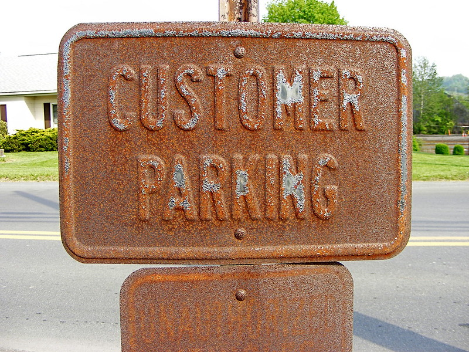

Title: No Ho0ber For Me!
Date: 2008-05-08 12:00
Category: Music
Cover: images/no_parking.jpg
Summary: So it appears that I've lost any hope of gaining access to my old blog, ho0ber.blogspot.com. For some reason it was linked to a hotmail account I don't remember having (not that it would tell me the actual address), and I surely don't remember what password I signed up with originally.

_This blog post originally appeared on [beefthief.blogspot.com](https://beefthief.blogspot.com/2008/05/no-ho0ber-for-me.html) and has been copied here for posterity and to remind myself of what I was like in 2008._

So it appears that I've lost any hope of gaining access to my old blog, [ho0ber.blogspot.com](https://ho0ber.blogspot.com). For some reason it was linked to a hotmail account I don't remember having (not that it would tell me the actual address), and I surely don't remember what password I signed up with originally. But hey, I've always been fond of being the "Beef Thief." It does say it it on [my business card](https://www.flickr.com/photos/ho0ber/2474893325/) after all.

Time to get down to business. This blog is not a journal into which I will clumsily scrawl useless information and my "deepest inner thoughts," because if I did it would leave my countless readers (optimism is key) both bored and ill. Instead it will be a way for me to share and discuss my creative exploits. Essentially, I'm tired of cluttering my AIM away messages with everything I've produced recently.

For those of you who don't know me well (in which case I'm slightly confused as to how you got here), I'm a musician (I go by SDC), an amateur photographer, and a programmer. I will regularly post new electronica tracks I've started working on as well as links to recent photographs I've taken. Yes, yes... I realize anyone can just take a look at my Flickr photo feed, but I'd prefer to post the shots I'm particularly proud of and discuss briefly how they came into existence. Maybe once Google gets around to buying Yahoo, and therefore Flickr, this whole process will be a little easier.

Now then, onto today's dosage of new stuff:

## Music: [Anticipation](https://www.ho0ber.com/sdc/03%20-%20Asphalt/Anticipation%20(Sample%202).mp3) (New Track in Progress)
It seems that insomnia and stress are a good way to bring out the muse in me. I've found that my brain is very good at coming up with new concepts and melodies at the point just between consciousness and sleep. At any rate, I'm very pleased with the results. Anticipation is off to a good start so far. I was really pleased with how well I managed to tweak the bass instrument, and I think the beat came out quite well. Please let me know what you think!

## Photography: [More Signs!](https://www.flickr.com/photos/ho0ber/sets/72157604766922455/)
So I have a bit of a sign fetish. I adore taking pictures of interesting signs when I see them. Incidentally, one of my other photography interests is texture, specifically rust. I think you can figure out the connection here.

So that's all for now, but more will come soon!
