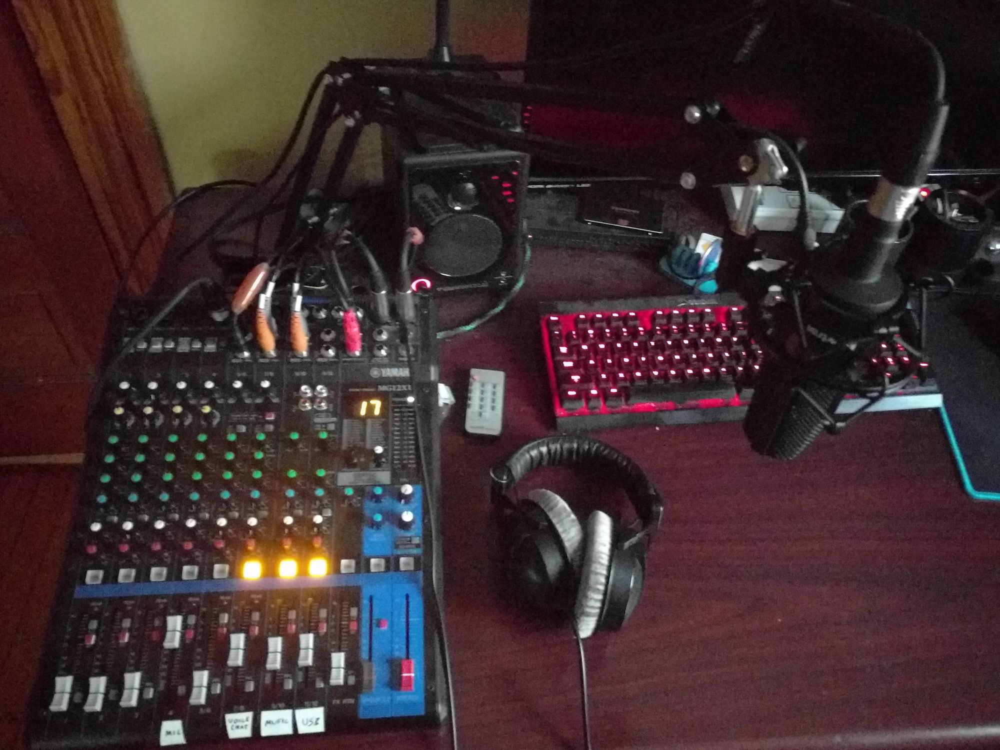
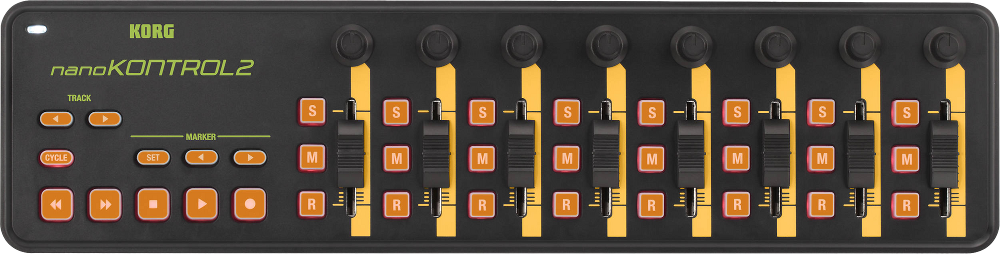
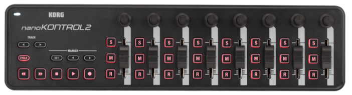
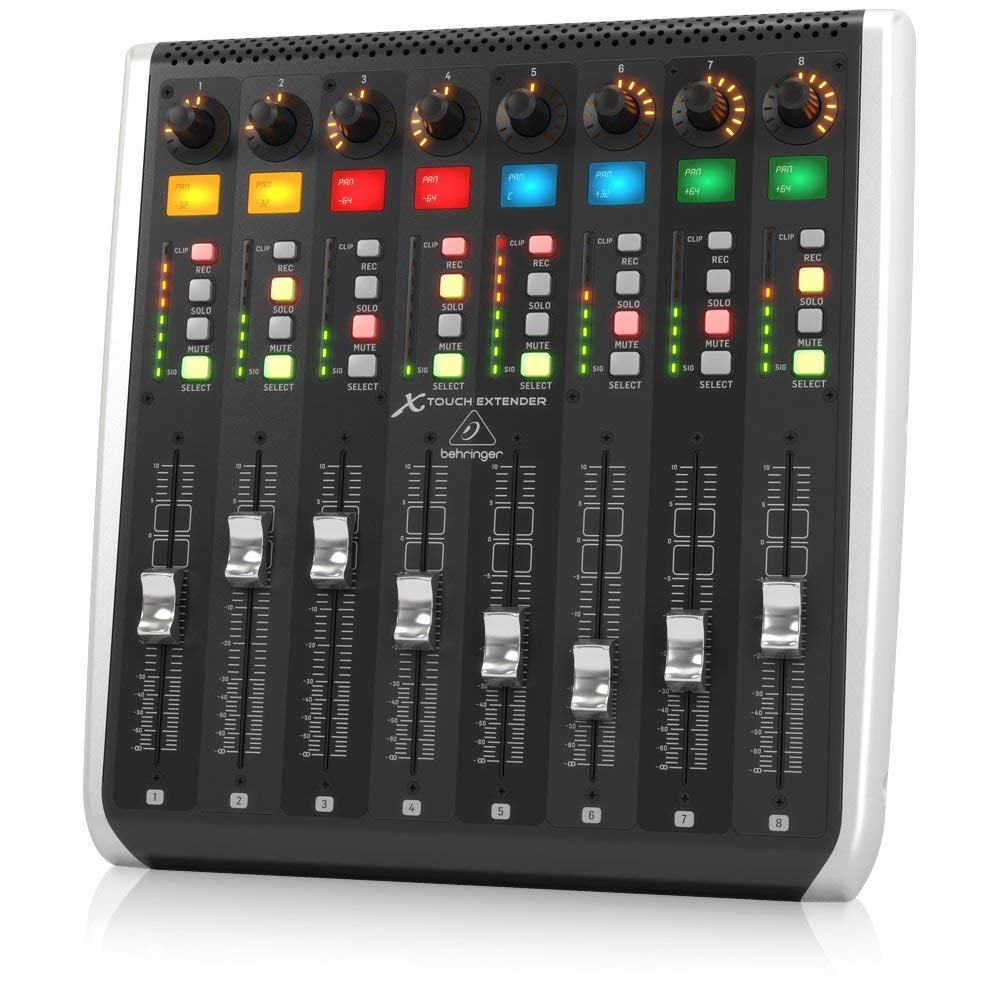

Title: Windows Volume Control with NK2 Tray
Date: 2019-03-02 12:00
Category: Code
Cover: images/nk2_2.png
Summary: A little over two years ago I found myself fighting with multiple soundcards, ground loop hum, software audio routing messes, and a tangle of cables. Why? I simply wanted the mixer on my desk to directly control game audio, music, and voice chat channels independently.

A little over two years ago I found myself fighting with multiple soundcards, ground loop hum, software audio routing messes, and a tangle of cables. Why? I simply wanted the mixer on my desk to directly control game audio, music, and voice chat channels independently.

A horrible quality shot of the original solution

After arriving on a solution that worked, I asked myself, "How do normal humans solve this problem?" The answer was pretty obvious, but not satisfying. "They just alt-tab and use the windows volume mixer."

I wasn't happy with that solution, but also disliked the complexity of my "working" solution, so I turned to my usual windows software toolbox and started writing some AutoHotkey script. In pretty short order I was able to adjust individual application volumes using key bindings. This was an improvement over alt-tabbing to the Windows mixer, but still felt clumsy compared to analog faders.

So why not the best of both worlds? Analog faders controlling the Windows volume mixer! I got my hands on the cheapest USB midi control surface I could find, the Korg nanoKONTROL2.

<!--  -->

I wonder if you can tell this is a product photo?

Using some existing midi and audio libraries for AHK I was able to hack together a working prototype in no time. I whipped up a quick video showing my project and promptly forgot about it.

<iframe width="560" height="315" src="https://www.youtube.com/embed/mxscBWjlrlc" title="YouTube video player" frameborder="0" allow="accelerometer; autoplay; clipboard-write; encrypted-media; gyroscope; picture-in-picture; web-share" allowfullscreen></iframe>

This prototype turned out to be stable enough that I used it for over two years with only minor modifications, and it turns out that a number of people who had watched my video decided to buy a nanoKONTROL2 just to use my software on it. As the emails and github issues started rolling for the prototype project, I started to realize that I was not easily going to be able to support further development on the project in its current state.

After months of dragging my feet on research and getting started on it, I dove back into the world of programming native Windows applications for the first time in over a decade. As a developer who does mostly back-end projects using open-source tech, this felt a lot like walking into the dragon's lair. As it turns out, a lot has improved in the space since I last wrote code built just for windows.

I landed on a C# Windows Forms application as the simplest path forward, and I stumbled across NAudio, a brilliantly written library that made a lot of the Core Audio and midi work a lot easier. After a few more weeks, I had a functioning alpha version of the project running and got it into the hands of a few loyal users of my prototype software.

<iframe width="560" height="315" src="https://www.youtube.com/embed/Ze23ua9O7Vk" title="YouTube video player" frameborder="0" allow="accelerometer; autoplay; clipboard-write; encrypted-media; gyroscope; picture-in-picture; web-share" allowfullscreen></iframe>

I also was able to add support for additional devices pretty easily. There's still a lot of work to do to make this truly stable and feature complete, but at least it's now something I feel confident that multiple developers could actually work together to support, rather than just the mess of copypasta that made up the original prototype.

I've open-sourced the rewrite, and I'm hoping that as adoption continues, we'll get more and more people interested enough to actually contribute. If that person is you, or if you'd like to try out the software, please check it out on the NK2 Tray project page on GitHub.

Additionally, if you want to help test or just talk shop, I encourage you to join our discord server!

The next major milestone for me on the project is to add support for a far more advanced controller, like the Behringer X-Touch Extender. The digital scribble strips, motorized faders, and per-channel volume meters really open up the possibilities of the project.

This definitely belongs in a spaceship

For now, I'm just excited to have a group of active users who are excited about something I built. That's a big part of what it means to write open source software, right?

Here are the links collected, with a few bonuses:

* [NK2 Tray GitHub Project](https://github.com/ho0ber/NK2Tray)
* [Discord Invite](https://discord.gg/BtVTYxpTh)
* [Original AutoHotkey Prototype Project](https://github.com/ho0ber/nk2-audio)
* [NAudio Library](https://github.com/naudio/NAudio)
* [X-Touch Extender](https://www.sweetwater.com/store/detail/XTouchEXT--behringer-by-touch-extender)
* [X-Touch Mini](https://www.sweetwater.com/store/detail/XTouchMini--behringer-by-touch-mini)
* [nanoKONTROL 2](https://www.sweetwater.com/store/detail/nanoKON2bk--korg-nanokontrol2-black)